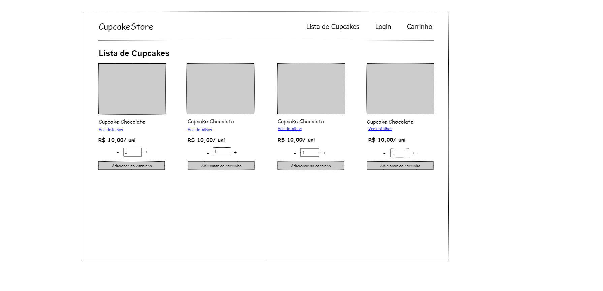
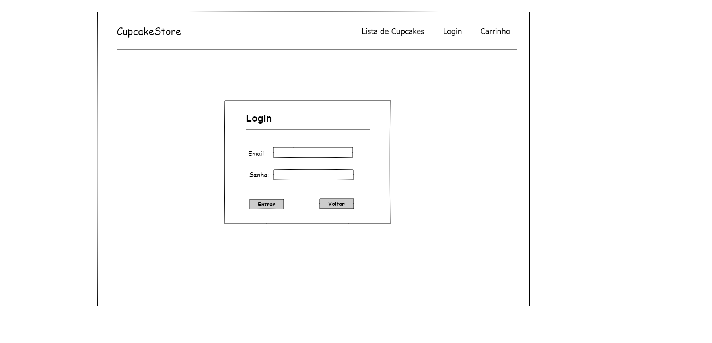
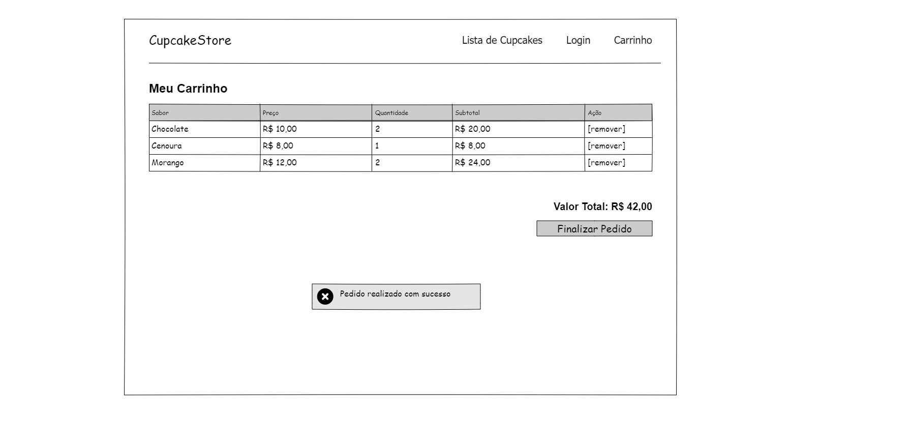
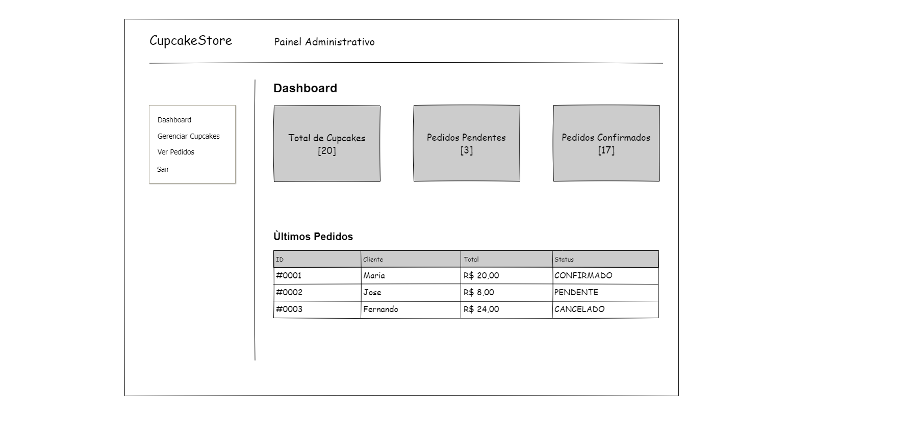
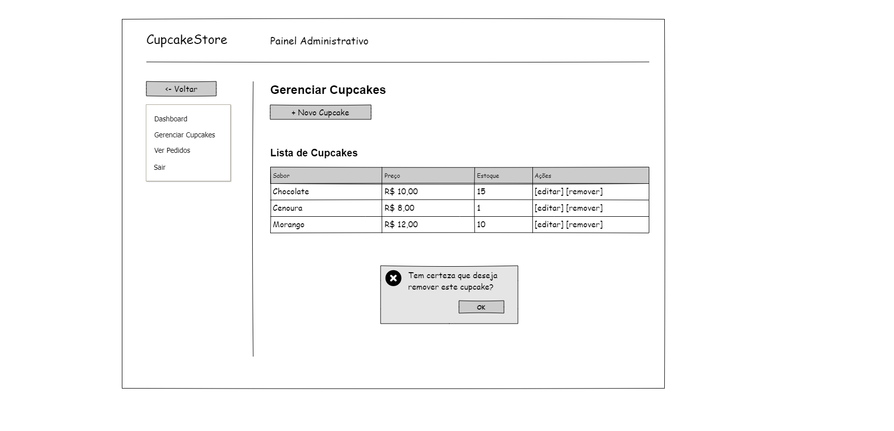

# 📌 Cupcake Store

Projeto Integrador Transdisciplinar em Engenharia de Software II - UNICSUL - Cruzeiro do Sul Virtual

## 🧭 Visão Geral

Este projeto consiste no desenvolvimento de um sistema utilizando **Java + Spring Boot**, estruturado a partir de uma base sólida de análise e modelagem antes da implementação.

O objetivo é construir a aplicação seguindo boas práticas de Engenharia de Software, com foco em clareza de requisitos, organização de domínio e preparação para escalabilidade.

---

## 🚀 Status do Projeto

Atualmente o projeto está na fase de:

**Análise e Especificação de Requisitos**, em transição para **Modelagem Estrutural**.

Antes de iniciar a implementação, foi estruturada toda a base de entendimento do sistema.

---

## Modelagem

O projeto segue princípios básicos de Domain-Driven Design (DDD),
com foco em agregados e comportamento no domínio.

Diagrama de classes disponível em:
docs/uml/class-diagram.puml

---

## 🗺 Roadmap

- [x] Levantamento de requisitos
- [x] Histórias de usuário
- [x] Critérios de aceitação (BDD)
- [x] Diagrama de classes
- [x] Diagrama de Casos de uso
- [x] Diagrama de Fluxo do Cliente
- [x] Diagrama de Atividades
- [x] Wireframes (HTML + CSS)
- [ ] Início da implementação com Java + Spring Boot
- [ ] Deploy inicial

---

## ✅ Etapas Concluídas

- ✔ Histórias de Usuário
- ✔ Testes de Aceitação (estruturados com base em comportamento – BDD)
- ✔ Fluxo de Trabalho
- ✔ Detalhamento de Requisitos
- ✔ Casos de Uso Expandidos Narrados
- ✔ Diagrama de Classes
- ✔ Diagrama de casos de uso
- ✔ Diagrama de atividades
- ✔ Wireframes da aplicação

Essa etapa garantiu clareza das regras de negócio e do comportamento esperado do sistema antes da implementação.

---

## Wireframes

Os wireframes abaixo representam a estrutura inicial da interface da aplicação.
Eles foram criados para validar o fluxo de navegação antes da implementação.

Todas as demais telas e diagramas podem ser encontradas na pasta `/docs`.

### Tela Inicial

### Login

### Carrinho

### Painel admin

### Gerenciamento de Cupcakes

---

## 🔜 Próximas Etapas

- 🔹 Implementação com Spring Boot
- 🔹 Estruturação da camada de persistência
- 🔹 Testes automatizados

---

## 🛠 Tecnologias Planejadas

- Java
- Spring Boot
- Banco de Dados (a definir)
- HTML + CSS / Thymeleaf
- JPA / Hibernate

---

## 📚 Abordagem Utilizada

Os critérios de aceitação foram estruturados utilizando o padrão **BDD (Behavior-Driven Development)**, organizando os comportamentos esperados no formato:

> Dado – Quando – Então

Essa abordagem aproxima regras de negócio da implementação e facilita a futura criação de testes automatizados.

---

## 🎯 Objetivo

Mais do que desenvolver funcionalidades, o foco deste projeto é praticar:

- Estruturação adequada de requisitos
- Organização do domínio
- Modelagem antes da implementação
- Mentalidade orientada a arquitetura

Planejamento também é engenharia.

---

## 📐 Arquitetura Planejada

A aplicação será estruturada seguindo uma organização em camadas, separando responsabilidades para manter o código mais claro, organizado e de fácil manutenção.

Estrutura prevista:

📦 controller  
Responsável por receber as requisições e retornar as respostas da aplicação.

📦 service  
Camada onde ficarão as regras de negócio e validações.

📦 repository  
Responsável pelo acesso e manipulação dos dados no banco.

📦 model (ou domain)  
Entidades que representam o domínio do sistema.

📦 dto  
Objetos de transferência de dados entre as camadas.

---

### 🔎 Organização por camadas

A estrutura seguirá o padrão:

Controller → Service → Repository → Banco de Dados

Essa organização facilita:

- Separação de responsabilidades
- Testabilidade
- Manutenção futura
- Evolução da aplicação
