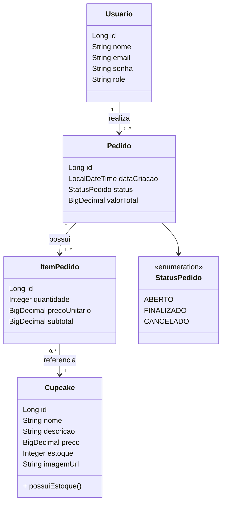

```mermaid
classDiagram

class Usuario {
    Long id
    String nome
    String email
    String senha
    String role
}

class Cupcake {
    Long id
    String nome
    String descricao
    BigDecimal preco
    Integer estoque
    String imagemUrl
    + possuiEstoque()
}

class Pedido {
    Long id
    LocalDateTime dataCriacao
    StatusPedido status
    BigDecimal valorTotal
}

class ItemPedido {
    Long id
    Integer quantidade
    BigDecimal precoUnitario
    BigDecimal subtotal
}

class StatusPedido {
    <<enumeration>>
    ABERTO
    FINALIZADO
    CANCELADO
}

Usuario "1" --> "0..*" Pedido : realiza
Pedido "1" --> "1..*" ItemPedido : possui
ItemPedido "0..*" --> "1" Cupcake : referencia
Pedido --> StatusPedido
```
